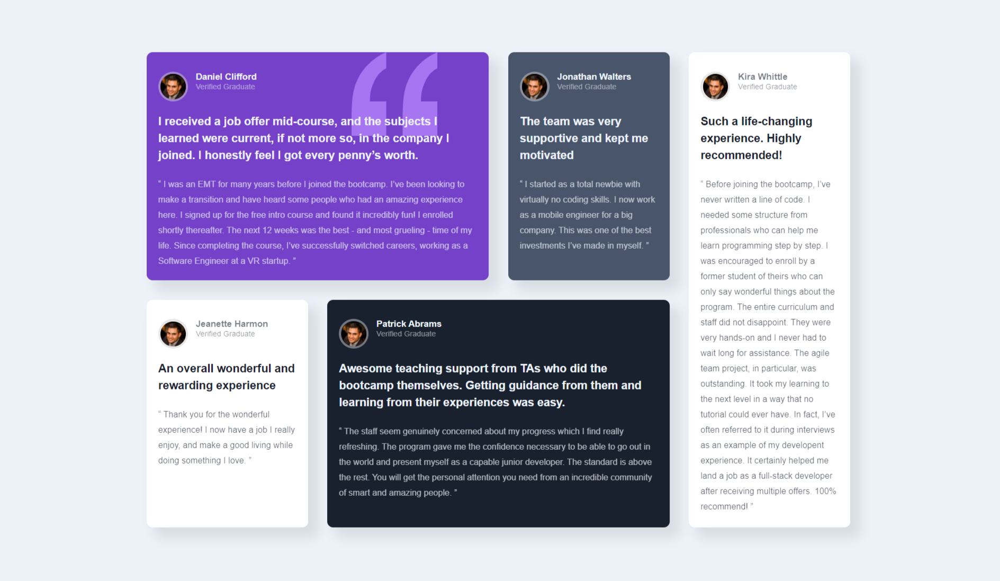

# Frontend Mentor - Testimonials grid section solution

This is a solution to the [Testimonials grid section challenge on Frontend Mentor](https://www.frontendmentor.io/challenges/testimonials-grid-section-Nnw6J7Un7). Frontend Mentor challenges help you improve your coding skills by building realistic projects. 

## Table of contents

- [Overview](#overview)
  - [The challenge](#the-challenge)
  - [Screenshot](#screenshot)
  - [Links](#links)
- [My process](#my-process)
  - [Built with](#built-with)
  - [What I learned](#what-i-learned)
  - [Continued development](#continued-development)
  - [Useful resources](#useful-resources)
- [Author](#author)


## Overview

### The challenge

Users should be able to:

- View the optimal layout for the site depending on their device's screen size

### Screenshot



### Links

- Solution URL: [Add solution URL here](https://your-solution-url.com)
- Live Site URL: [Add live site URL here](https://your-live-site-url.com)

## My process

### Built with

- Semantic HTML5 markup
- CSS custom properties
- CSS Grid
- Mobile-first workflow


### What I learned

I use this opportunity to explore and learn more about Grid and it's different tto flexbox


```css
.proud-of-this-css {
  display: grid;

  grid-template-columns: 1fr 1fr 1fr 1fr;
  grid-template-rows: 2fr 2fr;
  grid-template-areas:  "testimonial1 testimonial1 testimonial2 sidebar"
    "testimonial3 testimonial4 testimonial4 sidebar" ;


}


## Author

- Website - [Sodeeq Olaide Awoyemi here](https://www.your-site.com)
- Frontend Mentor - [@errytagedesign](https://www.frontendmentor.io/profile/errytagedesign)
- Twitter - [@errytage](https://www.twitter.com/errytage)


